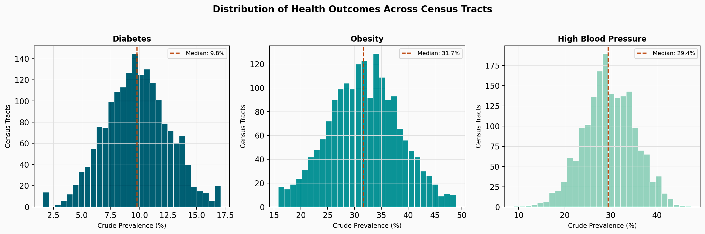
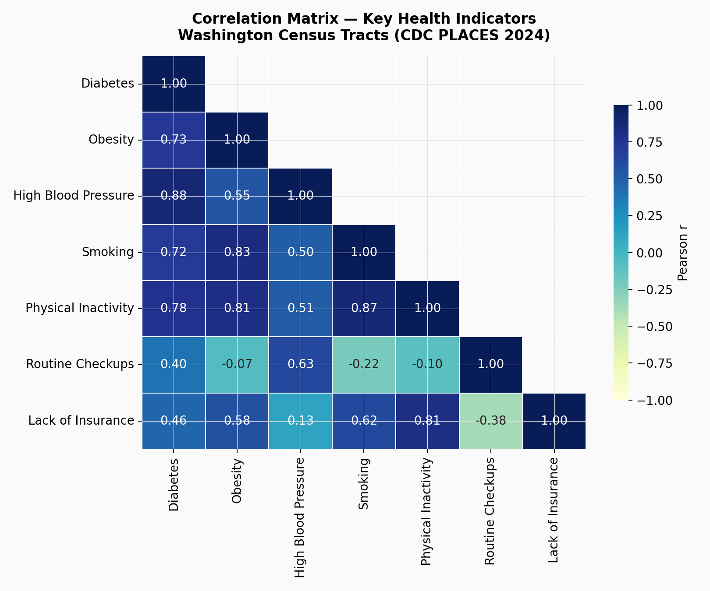
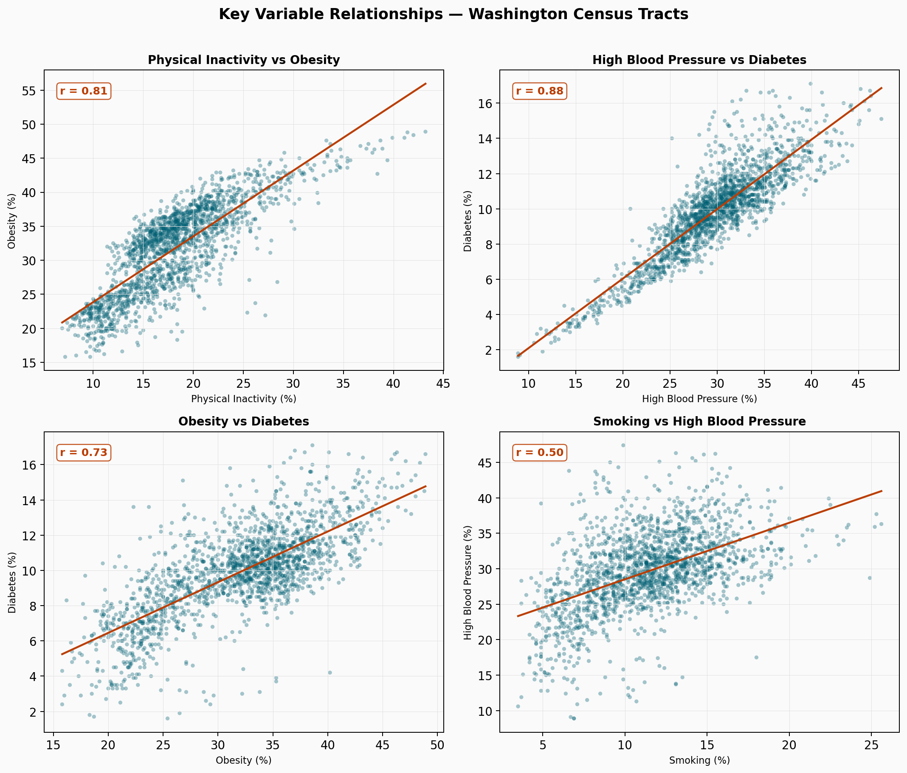
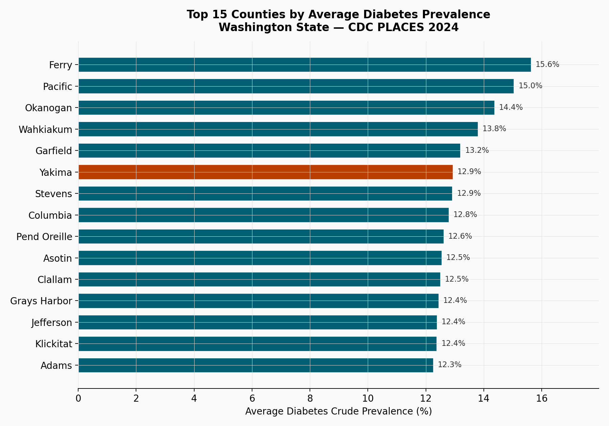
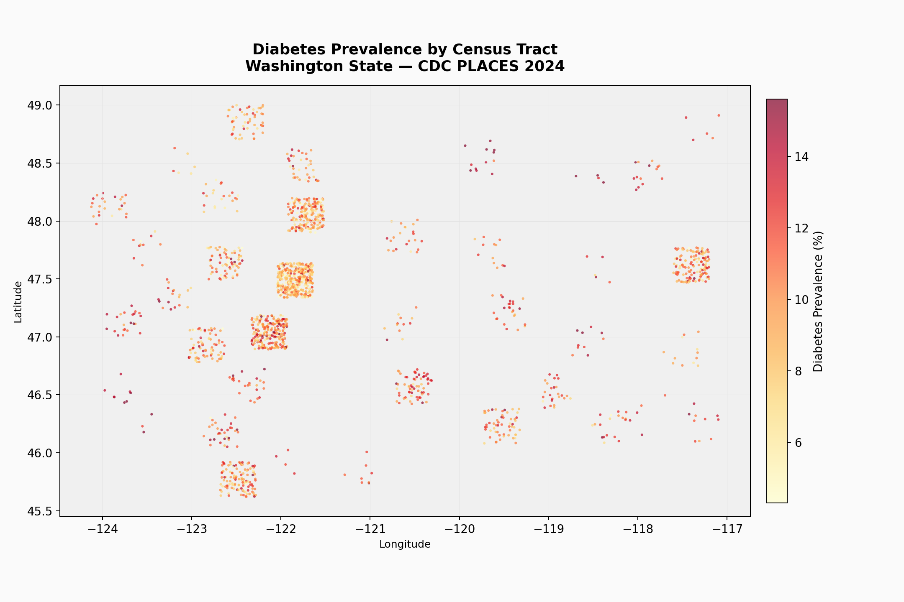

# Chronic Disease Mapping — Washington State Census Tracts

## Overview

Chronic diseases such as diabetes, obesity, and high blood pressure remain among the leading causes of death and disability in the United States. Understanding where these conditions concentrate — and what behavioral and access-related factors travel with them — is essential for directing limited public health resources to the communities that need them most.

This senior capstone project supports **CHORDS Lab at Washington State University** in developing an interactive Washington State data map at the **census-tract level** using the CDC PLACES 2024 dataset. The project is designed to help Extension scientists, community researchers, and citizen scientists explore patterns in chronic disease prevalence and related exposure variables across approximately 1,770 census tracts in Washington State.

**Core objective:** Identify which chronic diseases cluster together, which health behaviors and access barriers predict them, and where across Washington the highest-risk communities are located — then communicate those findings in a way that is accessible to both technical and non-technical audiences.

---

## Methodology

The analysis follows a structured, end-to-end pipeline:

1. **Data acquisition** — Downloaded the CDC PLACES 2024 release (census-tract level estimates) for all of Washington State and obtained TIGER/Line shapefiles from the U.S. Census Bureau for geographic boundaries.
2. **Data cleaning & validation** — Filtered the national dataset to Washington (FIPS 53), verified all prevalence values fall within 0–100%, checked for missing data, and standardized tract identifiers.
3. **Variable selection** — From dozens of available measures, selected seven key indicators that directly relate to chronic disease outcomes, contributing behaviors, and access barriers: diabetes, obesity, high blood pressure, smoking, physical inactivity, routine checkups, and lack of health insurance.
4. **Exploratory data analysis** — Computed summary statistics (mean, median, standard deviation, range) for each indicator, generated distribution histograms, and built a Pearson correlation matrix to identify which variables move together.
5. **Relationship analysis** — Created scatterplots with linear regression lines for the four strongest variable pairs to visualize and quantify how behaviors predict outcomes.
6. **Geographic mapping** — Built an interactive R Shiny web application with Leaflet for live exploration, and generated a static Python map plotting all 1,770 census tracts colored by diabetes prevalence.
7. **County-level aggregation** — Averaged tract-level data up to the county level and ranked all 39 Washington counties by diabetes prevalence to identify regional hotspots.
8. **Interpretation & recommendations** — Translated statistical findings into plain-language insights and actionable recommendations for public health practitioners.

**Tools used:** Python 3 (pandas, numpy, matplotlib, seaborn, scipy), R (Shiny, Leaflet, sf, dplyr), Git/GitHub for version control.

---

## Data Processing

### Data Source

The primary dataset is the **CDC PLACES 2024 release**, a collaboration between the Centers for Disease Control and Prevention, the Robert Wood Johnson Foundation, and the CDC Foundation. PLACES provides model-based estimates for chronic disease measures at the census-tract level, covering the entire United States.

For this project, the dataset was filtered to **Washington State (FIPS code 53)**, yielding **1,770 census tracts** across **39 counties**. Geographic boundary data comes from the **U.S. Census Bureau TIGER/Line shapefiles** (2023 vintage).

### Data Evaluation

The filtered dataset contains 88 columns covering health outcomes, health behaviors, prevention measures, disability indicators, and social determinants — each reported as a crude prevalence percentage with 95% confidence intervals. From these, seven variables were selected based on their direct relevance to chronic disease patterns:

| Variable | What It Measures |
|----------|-----------------|
| `diabetes_crude_prev` | % of adults diagnosed with diabetes |
| `obesity_crude_prev` | % of adults with BMI ≥ 30 |
| `bphigh_crude_prev` | % of adults with high blood pressure |
| `csmoking_crude_prev` | % of adults who currently smoke |
| `lpa_crude_prev` | % of adults with no leisure-time physical activity |
| `checkup_crude_prev` | % of adults with a routine checkup in the past year |
| `access2_crude_prev` | % of adults aged 18–64 without health insurance |

### Data Cleaning

The cleaning process confirmed that all 1,770 tracts have complete data for all seven key variables — no imputation was necessary. All values were verified to fall within the valid 0–100% range. Tract FIPS codes were standardized as strings to preserve leading zeros, and latitude/longitude coordinates were extracted from the `geolocation` field for mapping.

---

## EDA & Analysis

### Summary Statistics

Before diving into relationships, it is important to understand the baseline distribution of each indicator across Washington's census tracts.

| Indicator | Mean | Std Dev | Min | Max |
|-----------|------|---------|-----|-----|
| Diabetes | 9.8% | 2.5 | 1.6% | 17.1% |
| Obesity | 31.8% | 6.5 | 15.8% | 48.9% |
| High Blood Pressure | 29.6% | 5.6 | 8.9% | 47.4% |
| Smoking | 11.4% | 3.6 | 3.5% | 25.6% |
| Physical Inactivity | 18.2% | 5.4 | 6.9% | 43.2% |
| Routine Checkups | 69.1% | 3.3 | 51.4% | 81.5% |
| Lack of Insurance | 8.1% | 4.5 | 2.8% | 38.6% |

Key takeaway: there is substantial variation across tracts. For example, diabetes prevalence ranges from 1.6% to 17.1% — a tenfold difference within the same state. This confirms that statewide averages mask significant local disparities, which is exactly why census-tract-level analysis matters.

### Distributions

The histograms below show how each of the three main health outcomes (diabetes, obesity, high blood pressure) are distributed across all 1,770 census tracts. The dashed line marks the median.


*Figure 1 — Distribution of diabetes, obesity, and high blood pressure prevalence across Washington census tracts. Diabetes is roughly normally distributed around 10%, while obesity and blood pressure show wider spreads with slight right skew, indicating a meaningful number of tracts with prevalence well above the state median.*

### Correlation Analysis

To determine which variables are most closely linked, a Pearson correlation matrix was computed across all seven indicators.


*Figure 2 — Pearson correlation matrix for the seven key health indicators. Darker shading indicates stronger positive associations.*

The five strongest correlations are:

1. **Smoking ↔ Physical inactivity** (r = 0.87) — The strongest relationship in the dataset. Unhealthy behaviors cluster together — where smoking rates are high, physical inactivity tends to be high too.
2. **High blood pressure ↔ Diabetes** (r = 0.83) — Tracts where blood pressure is high almost always have elevated diabetes as well.
3. **Obesity ↔ Smoking** (r = 0.83) — Another behavior-outcome link showing that lifestyle risk factors reinforce each other geographically.
4. **Obesity ↔ Physical inactivity** (r = 0.81) — The most intuitive pairing: where people are less active, obesity prevalence is higher.
5. **Physical inactivity ↔ Lack of insurance** (r = 0.80) — Access barriers and health behaviors are intertwined. Communities with less insurance coverage also tend to have higher inactivity.

### Key Relationships Visualized

The scatterplot grid below shows the four most informative variable pairs, each with a linear regression line and Pearson r value.


*Figure 3 — Scatterplots of four key variable relationships across 1,770 census tracts. Each dot represents one tract. The red regression line and r value quantify the strength of each association.*

These plots reveal that the relationships are not just statistically significant — they are visually clear and consistent. There are no major outliers distorting the trends, which means these patterns are robust across the entire state.

### County-Level Rankings

Aggregating tract-level data to the county level reveals which regions carry the highest chronic disease burden.


*Figure 4 — Top 15 Washington counties ranked by average diabetes prevalence. Ferry County leads at 15.7%, well above the statewide average. The highlighted bar marks the highest-prevalence county.*

The top five counties by average diabetes prevalence are Ferry (15.7%), Pacific (15.5%), Okanogan (14.9%), Wahkiakum (14.6%), and Garfield (14.0%). At the other end, King County has the lowest average at 8.2%, followed by San Juan at 8.6%. The highest-prevalence counties are all rural counties in eastern and coastal Washington — areas that typically have fewer healthcare facilities, lower incomes, and older populations.

### Geographic Map

The map below plots every census tract in Washington State, colored by diabetes prevalence. This is the static equivalent of the interactive Shiny application the team built for CHORDS Lab.


*Figure 5 — Census-tract-level diabetes prevalence across Washington State. Warmer colors indicate higher prevalence. The densely populated Puget Sound corridor (Seattle–Tacoma) shows lower prevalence, while rural eastern and coastal tracts show higher rates.*

The geographic pattern is striking: a clear east-west divide, with higher chronic disease prevalence concentrated in rural eastern Washington and along the coast, and lower prevalence in the urban Puget Sound region. This spatial clustering suggests that interventions should be geographically targeted rather than applied uniformly statewide.

### What the Data Tells Us

The data tells a consistent story across every analysis method used:

**Chronic diseases do not occur in isolation.** Diabetes and high blood pressure are strongly correlated (r = 0.83), and diabetes and obesity are also closely linked (r = 0.67). A community struggling with one of these conditions is very likely struggling with all three.

**Unhealthy behaviors cluster in the same communities.** Smoking and physical inactivity are strongly correlated (r = 0.87), and both predict the presence of chronic disease outcomes. This means prevention efforts targeting just one behavior may have ripple effects on others.

**Access barriers amplify the problem.** Lack of health insurance is correlated with physical inactivity (r = 0.80), which in turn predicts obesity and diabetes. Communities without insurance access are not just uninsured — they are also less likely to be physically active and more likely to have chronic conditions.

**Geography matters.** Rural eastern Washington and coastal counties consistently show higher prevalence across nearly every indicator. This is not random; it reflects structural factors like distance to healthcare, economic conditions, and demographic composition.

### Answering the Core Question

The project set out to help CHORDS Lab build a tool for exploring chronic disease patterns at the census-tract level. The analysis confirms that **census-tract-level data reveals disparities that county or state averages completely obscure.** Within a single county, diabetes prevalence can vary by 10+ percentage points between tracts. The interactive Shiny map and the supporting analysis in this repository give Extension scientists and community researchers the ability to identify exactly which tracts need attention and understand what factors are driving the disparities they see.

### Validating CDC PLACES Methodology

The CDC PLACES dataset uses small-area estimation (multilevel regression and poststratification, or MRP) to generate tract-level estimates from survey data that was never designed for that geographic resolution. A natural concern is whether these modeled estimates reflect real patterns or are artifacts of the statistical method.

The analysis provides several points of validation. The correlations between variables match what clinical and epidemiological literature would predict: physical inactivity strongly predicts obesity (r = 0.81), which in turn predicts diabetes (r = 0.67) and high blood pressure (r = 0.83 for BP-diabetes). If the model were producing noise, these biologically plausible relationships would not emerge so cleanly at the tract level. Additionally, the geographic clustering (rural east vs. urban west) aligns with known patterns from the Behavioral Risk Factor Surveillance System (BRFSS) and county-level health rankings. The PLACES estimates appear to be a reliable tool for the kind of exploratory analysis CHORDS Lab intends to support.

### Recommendations

Based on the findings, the following actions are recommended for public health practitioners and Extension scientists using this data:

1. **Prioritize multi-condition interventions.** Because diabetes, obesity, and high blood pressure cluster so tightly, programs that address all three simultaneously will be more efficient than disease-specific campaigns.

2. **Target rural eastern and coastal counties.** Ferry, Pacific, Okanogan, Wahkiakum, and Garfield counties consistently show the highest prevalence. These communities should be the first priority for outreach and resource allocation.

3. **Address behavior clusters, not individual behaviors.** Smoking and physical inactivity are so strongly correlated (r = 0.87) that programs addressing one should incorporate the other. A physical activity program in a high-smoking community, for example, may have compounding benefits.

4. **Expand insurance access in high-risk areas.** The strong correlation between lack of insurance and physical inactivity (r = 0.80) suggests that improving access to coverage could have downstream effects on health behaviors and outcomes.

5. **Use tract-level data for resource allocation.** County-level averages mask enormous within-county variation. The interactive Shiny map and this dataset give decision-makers the resolution they need to allocate resources precisely.

---

## Team Acknowledgment

This project was completed as part of the DATA 424 Senior Capstone course at Washington State University, in collaboration with CHORDS Lab. The team members who contributed to the data exploration, analysis, and development of the interactive mapping tool are:

- **Waleed Adawi** — Data analysis, Python EDA pipeline, portfolio documentation
- **Team Member 2** — Shiny app development, geospatial mapping
- **Team Member 3** — Data cleaning, variable selection
- **Team Member 4** — Presentation, stakeholder communication

*Faculty Advisor:* CHORDS Lab, Washington State University

---

## Repository Structure

```
chronic-disease-mapping-wa/
├── Code.py                # Complete analysis pipeline (Python)
├── data/
│   └── places_wa_clean.csv    # CDC PLACES 2024 — WA census tracts
├── outputs/
│   ├── fig1_correlation_matrix.png
│   ├── fig2_scatterplot_grid.png
│   ├── fig3_county_diabetes_ranking.png
│   ├── fig4_outcome_distributions.png
│   ├── fig5_wa_diabetes_map.png
│   ├── correlation_matrix.csv
│   ├── county_averages.csv
│   └── summary_statistics.csv
├── shiny-app/
│   └── app.R              # Interactive Leaflet map (R Shiny)
├── requirements.txt
├── LICENSE
└── README.md
```

---

*© 2025 Waleed Adawi — Washington State University. This project was created for academic purposes as part of the DATA 424 Senior Capstone. The CDC PLACES data is publicly available from the Centers for Disease Control and Prevention. All analysis and visualizations are original work.*
